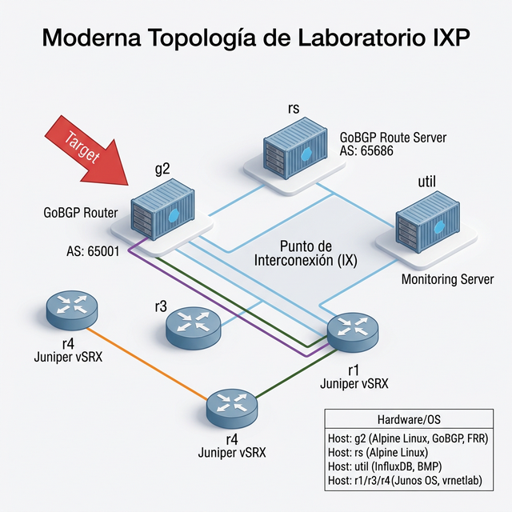

# Laboratorio IXP - Containerlab

Este repositorio contiene la arquitectura, topología y automatizaciones para un entorno de Laboratorio IXP simulado usando Containerlab. Reemplaza el enfoque hipervisor pesado (VirtualBox) por uno ágil basado en contenedores.

## Topología de Red

El laboratorio recrea una infraestructura típica de **Intercambio de Tráfico (IXP)** conectando enrutadores de diversas marcas y un Route Server usando sesiones BGP y OSPF.



## Componentes

- **g2**: GoBGP Router (AS 65001)
- **rs**: GoBGP Route Server (AS 65686)
- **util**: Servidor de Monitoreo (InfluxDB, BMP)
- **r1, r3, r4**: Juniper vSRX virtualizados con vrnetlab

## Despliegue

Asegúrate de tener instalado [Containerlab](https://containerlab.dev/).

```bash
sudo clab deploy -t ixp-lab.clab.yml
```

## Prácticas Enterprise Mantenidas
1. Infraestructura como código (esta configuración en YAML)
2. Inmutabilidad en los nodos GoBGP usando imágenes específicas.
3. Observabilidad nativa orientada a BMP y Streaming Telemetry (vs SNMP).
4. Limites de recursos (Prefix limits).
